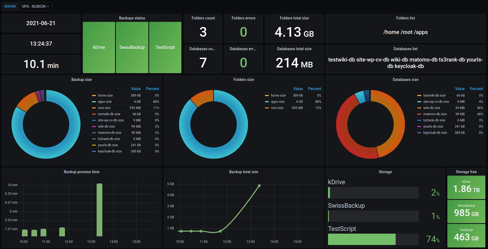
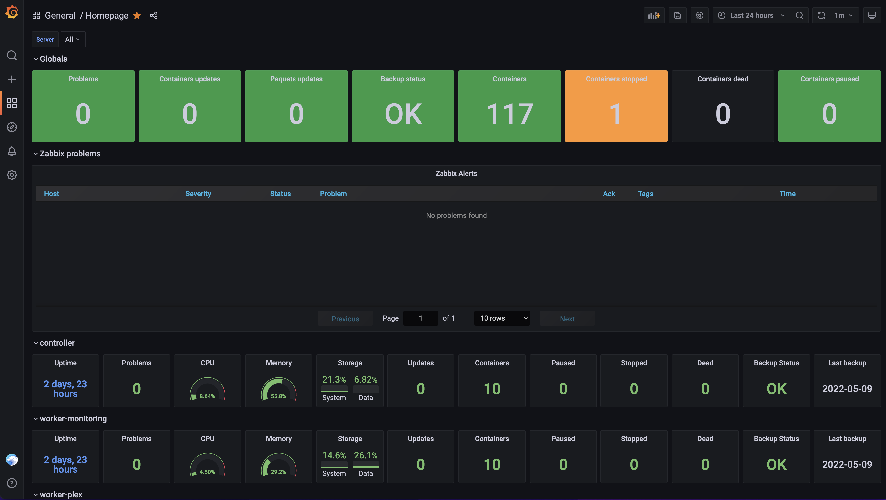
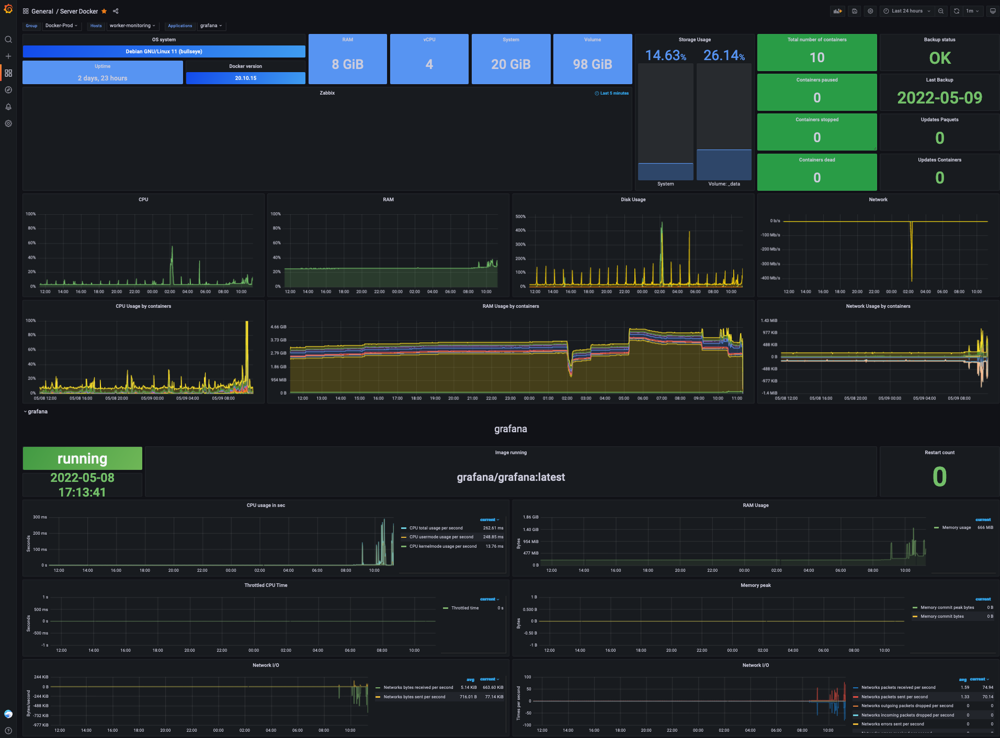
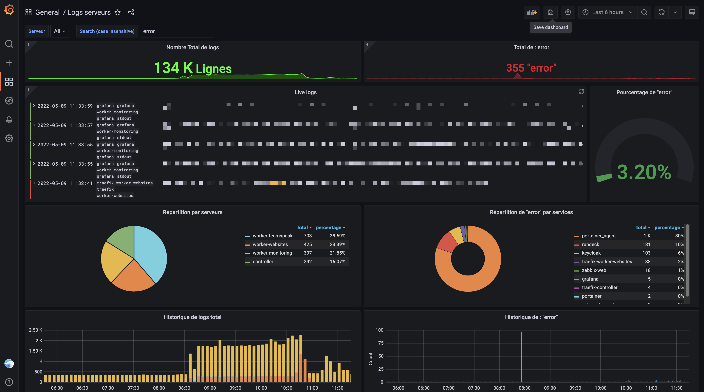
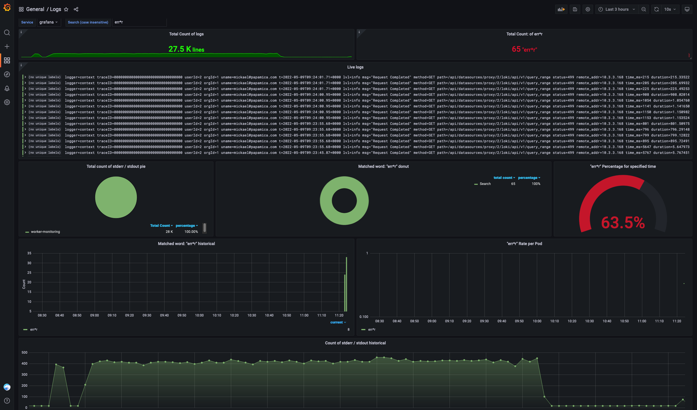

You will find on this repo all my templates.

I invite you to refer to the different projects to be sure to get the latest templates.

If you have templates (of any kind) to add, don't hesitate to MR ❤️

## Projects
- [Backup-Script](https://github.com/PAPAMICA/Backup-Script)
- [Container-Updater](https://github.com/PAPAMICA/container-updater)

## Screenshots
### Backup-Script

### Zabbix-Homepage-Cluster-Docker

### Zabbix-Server-Docker

### Loki-Logs-Servers

### Loki-Logs-Services
